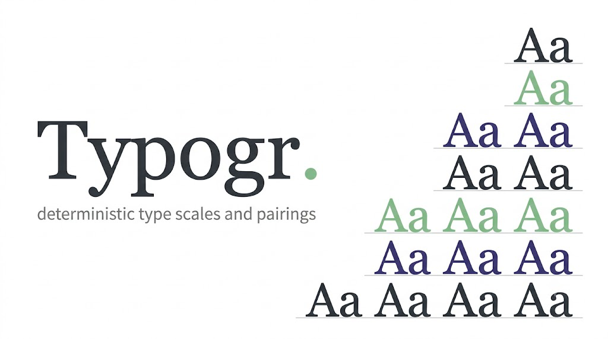
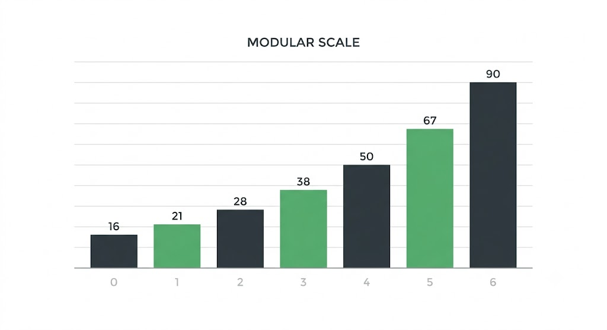
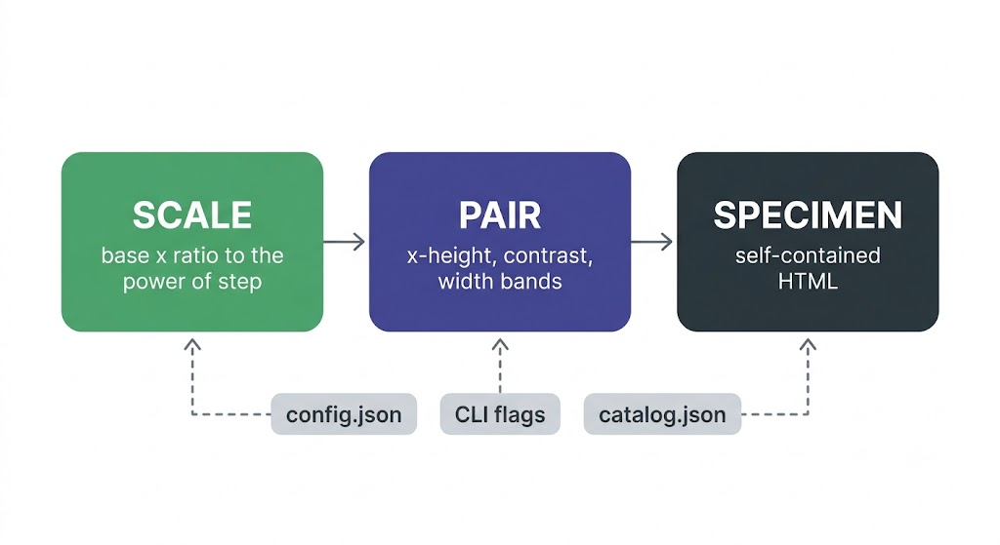
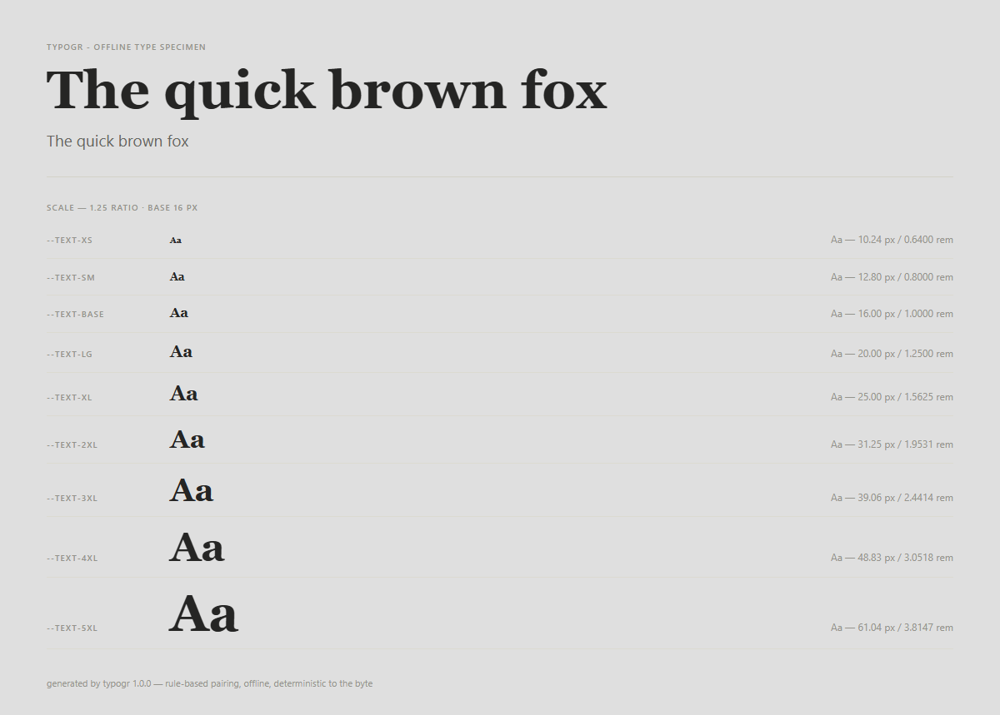

<p align="center">
  
</p>

<h3 align="center">Typogr — offline typography scales and pairings, deterministic to the byte</h3>

<p align="center">
  
  
  
  
  
</p>

<p align="center">
  <b>What sizes should the text be — and which two fonts actually go together?</b><br>
  One base, one ratio, three geometry bands: every size named, every pair scored, and a
  self-contained specimen you can open before you commit.
</p>

---

## The scale figure

<p align="center">
  
</p>

*each step is a true power of the ratio — `px = base * ratio ** step` — so float error never drifts in over long scales.*

## Why

Every type-scale and pairing tool out there is a stateful browser app that
phones home to Google Fonts: it keeps your picks in localStorage, fetches its
font list from the network, and re-renders with JavaScript. Typogr is the
opposite — a zero-dependency CLI that runs on the standard library, works
with no network, and prints the same bytes on every machine, every time.

More importantly, it does not shuffle fonts. It scores a display/body pair
against x-height, stroke-contrast and width geometry, explains the result in
plain rule-based English, and typesets your scale into a self-contained
specimen you can open in a browser before you commit to the pairing.

## Quickstart

No install step — there is no pip step. Run it directly from the project
root:

```console
python -m typogr scale
python -m typogr scale --base 18 --ratio 1.333 --name step --emit css
python -m typogr pair --pair Georgia,Verdana
python -m typogr pair --seed 1337 --top 5
python -m typogr specimen --display Georgia --body "system-ui, Arial, sans-serif" --out specimen.html
```

All three subcommands accept `--json` for machine-readable output and
`--version` for the release tag. An optional JSON config file fills in
defaults; CLI flags always override it:

```console
python -m typogr scale --config sample/config.json --ratio 1.4
```

`sample/config.json` is a working example:

```json
{
  "base": 16,
  "ratio": 1.25,
  "steps_below": 2,
  "steps_above": 6,
  "root": 16,
  "naming": "t-shirt"
}
```

## The pipeline

<p align="center"></p>

1. **Scale** — `base × ratio^step` for each step; px rounded to 2 decimals, rem derived from the unrounded px and rounded to 4; named by `t-shirt`, `step`, or `heading`; emitted as CSS custom properties or JSON.
2. **Pair** — the display/body pair is scored across three geometry bands (x-height ratio 40 pts, stroke-contrast difference 30, width ratio 30); a near-twin guard caps nearly identical faces at 55; the readout is rule-based prose, never fabricated attribution.
3. **Specimen** — the scale and the pair are typeset into one self-contained HTML file: inline CSS only, zero external requests, `@media print` rules included.

## Scale math

Each step is a true power of the ratio, not a repeated multiply (which lets
float error drift in over long scales):

    px = base * ratio ** step

- `px` is rounded to **2 decimals**; `rem = px / root` is rounded to
  **4 decimals** (rem is derived from the unrounded px, so rounding never
  compounds — and `1.5625rem` is legitimate and kept).
- Guards: `ratio <= 0` is an error (CLI exit 2); `ratio == 1` warns
  (constant scale); `ratio < 1` warns (the scale descends as the step grows);
  steps whose `px` exceeds **4096** are truncated with a warning. `base` and
  `root` must be `> 0`.

## Pairing model

Three geometry bands, weights summing to 100:

| Band | Sweet zone | Points | Falloff to 0 |
|---|---|---|---|
| x-height ratio (display / body) | 0.9 – 1.1 | 40 | linear at 0.6 / 1.5 |
| stroke-contrast difference | < 0.3 or > 1.7 | 30 | 0 at 1.0, linear on both sides |
| width ratio (display / body) | 0.75 – 1.25 | 30 | linear at 0.5 / 2.0 |

**Near-twin guard.** Same category with x-heights within 0.05 em of each
other caps the score at 55: two nearly identical faces are a boring pair, not
a good one. The cap is flagged in `--json` output (`capped`,
`total_before_cap`) and explained in the prose readout.

The prose readout is explicitly **rule-based** — typogr never fabricates
expert attribution.

The font metrics in `sample/catalog.json` (x-height, stroke contrast,
average width) are **curated approximations** of web-safe fonts, hand-tuned
for pairing math — not measurements parsed from the font binaries. There is
no runtime font parsing by design: fontTools is not stdlib, and typogr must
work offline on Python ≥ 3.9 with zero dependencies.

## Naming schemes

| Scheme | −2 | −1 | 0 | +1 | +2 | +3 | +4 | +5 | +6 |
|---|---|---|---|---|---|---|---|---|---|
| `t-shirt` (default) | `--text-xs` | `--text-sm` | `--text-base` | `--text-lg` | `--text-xl` | `--text-2xl` | `--text-3xl` | `--text-4xl` | `--text-5xl` |
| `step` | `--step--2` | `--step--1` | `--step-0` | `--step-1` | `--step-2` | `--step-3` | `--step-4` | `--step-5` | `--step-6` |
| `heading` | — | — | — | `--h6` | `--h5` | `--h4` | `--h3` | `--h2` | `--h1` |

`t-shirt` mirrors Tailwind's sm/base/lg/xl/2xl/3xl for paste-friendliness and
extends both directions for extra steps (`--text-5xl`, `--text-2xs`, …).
`heading` puts `--h1` on the largest positive step and only labels positive
steps.

## The specimen

<p align="center">
  
</p>

<p align="center"><sub><b>Sample specimen</b> — regenerated via <code>python -m typogr specimen --out specimen.html</code>.</sub></p>

Every token on the page comes from the scale and the pair: the hero line, the
Aa rows, the px/rem columns, the fallback stacks, the print rules — inline
CSS only, so the file is the deliverable.

## Testing

```console
python -m pytest tests -q
python -m compileall typogr
```

The suite (44 tests) covers the scale math (known values,
power-not-multiply, guards, the 4096 cap, all three naming schemes), the
pairing model (band scores, near-twin cap, seeded recommend determinism,
unknown-font suggestions), the CSS emitter (sorted output, exact header,
precision, line-height/letter-spacing defaults, determinism), the specimen
document (every token, Aa rows, fallback stacks, print rules, zero `http`),
and the CLI (JSON shapes, exit code 2 on bad input, version, byte-stable
recommend output).

## Design

The specimen page uses the **Atelier** look: paper `#DFDFDF`, ink `#252524`,
secondary ink `#676662` / `#94938C` for caps labels, hairlines `#DCDAD1` /
`#D4D2C8`, small-caps labels at 10 px with 0.10 em tracking, a Georgia-based
display stack and a system-ui body stack. The score banner, the Aa preview
rows and the paired hero are inline-CSS only — no external resources, and
`@media print` rules keep it clean on paper.

## License

MIT — see [LICENSE](LICENSE). Copyright (c) 2026 adithyanraj03.
